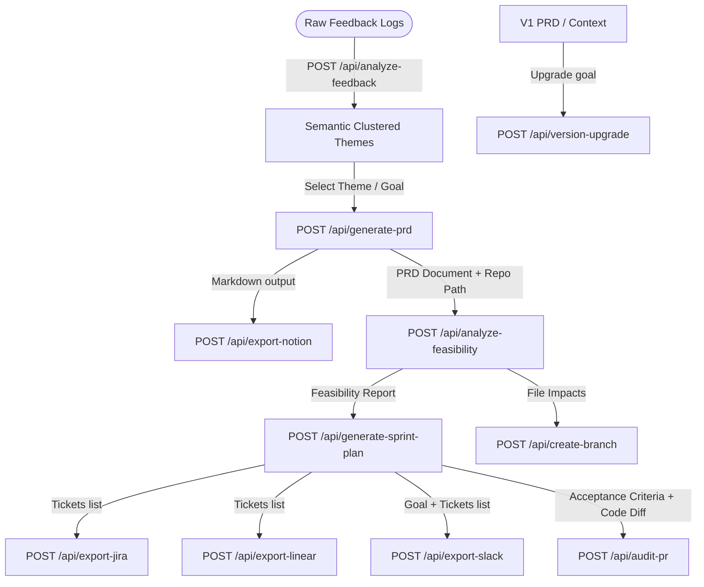

# API Keys Configuration, Workflows, & Postman Testing Guide

This guide provides step-by-step instructions to get credentials for each integration, outlines the core system workflows, and catalogs sample JSON payloads and mock responses for testing all 13 endpoints.

---

## 1. Third-Party API Keys Setup Guide

### Google Gemini API
1. Visit [Google AI Studio](https://aistudio.google.com/).
2. Click **Create API Key**.
3. Copy the key and add it to your `.env` file:
   `GEMINI_API_KEY=AIzaSy...`

### Groq API
1. Visit the [Groq Console](https://console.groq.com/).
2. Create an account, go to **API Keys**, and click **Create API Key**.
3. Copy the key and define:
   `GROQ_API_KEY=gsk_...`
   `GROQ_MODEL=llama-3.3-70b-versatile`

### Jira Cloud
1. Go to your Jira instance dashboard.
2. Navigate to **Account Settings** -> **Security** -> **Create and manage API tokens** (or visit [Atlassian API Tokens](https://id.atlassian.com/manage-profile/security/api-tokens)).
3. Generate a token and save it.
4. Set the following in `.env`:
   - `JIRA_URL=https://your-company.atlassian.net`
   - `JIRA_EMAIL=your-login-email@company.com`
   - `JIRA_API_TOKEN=your_generated_api_token`
   - `JIRA_PROJECT_KEY=PROJ` (Create a blank Scrum project in Jira to get the key)

### Notion API
1. Go to [Notion Integrations](https://www.notion.so/my-integrations).
2. Click **+ New Integration**, name it (e.g., "PM Copilot"), and select your workspace.
3. Save it to get the **Internal Integration Token** (`secret_...`).
4. In Notion, open the parent page where you want documents created. Click `...` in the top right, go to **Connections**, search for your integration, and click **Connect**.
5. Copy the 32-character UUID from the parent page's URL (e.g., `https://notion.so/My-Page-abc123xyz...` -> `abc123xyz...`).
6. Set in `.env`:
   - `NOTION_API_KEY=secret_...`
   - `NOTION_PARENT_PAGE_ID=abc123xyz...`

### Linear API
1. Go to Linear -> **Settings** -> **API**.
2. Under **Personal API Keys**, type a name and click **Create Key**.
3. Copy the key (`lin_api_...`).
4. Go to Settings -> Teams, select your team, and copy the **Team ID** (UUID) from the address bar or workspace settings.
5. Set in `.env`:
   - `LINEAR_API_KEY=lin_api_...`
   - `LINEAR_TEAM_ID=team_uuid_here`

### Slack Webhooks
1. Visit [Slack API Apps Console](https://api.slack.com/apps).
2. Click **Create New App** -> Select **From scratch**, name it, and select your workspace.
3. Under Features, click **Incoming Webhooks** and switch the toggle to **Activate**.
4. Click **Add New Webhook to Workspace**, select a channel, and click **Allow**.
5. Copy the generated URL (`https://hooks.slack.com/services/...`).
6. Set in `.env`:
   - `SLACK_WEBHOOK_URL=https://hooks.slack.com/services/...`

### GitHub Access Token
1. Go to GitHub -> **Settings** -> **Developer Settings** -> **Personal Access Tokens** -> **Tokens (classic)**.
2. Click **Generate new token (classic)**.
3. Enable scopes: `repo` (full control of private repositories).
4. Click Generate, copy token (`ghp_...`).
5. Set in `.env`:
   - `GITHUB_ACCESS_TOKEN=ghp_...`

### GitLab Access Token
1. Go to GitLab -> **Preferences** -> **Access Tokens**.
2. Click **Add new token**, select scopes: `api`, `write_repository`.
3. Create, copy token (`glpat-...`).
4. Set in `.env`:
   - `GITLAB_ACCESS_TOKEN=glpat-...`

---

## 2. Core Copilot Logic & Workflow Workspaces



### Flow Breakdown:
1. **Analyze Customer Feedback**: Group bug logs and feature requests into themes, assessing sentiment and urgency.
2. **Generate PRD**: Create version 1.0 specifications for the top-priority theme.
3. **Analyze Feasibility**: Scan the codebase, estimate effort hours, list technical risks, and identify impacted files.
4. **Decompose Sprint Plan**: Create structured backlog tasks with story points and role assignments based on code impact.
5. **Export & Alert**: Sync tasks to Jira/Linear, update the Slack channel, and stage developer branches.
6. **Audit & Evolve**: Audit developer Pull Requests against the PRD acceptance criteria. For new releases, upgrade previous PRDs incrementally using previous codebase context.

---

## 3. Endpoints Directory & Postman Payloads

### 1. Diagnostic / Connection
*   `GET /api/test-connection`
    *   **Workflow**: Checks if Groq (or Gemini fallback) is configured and sends a ping.
    *   **Response**:
        ```json
        {
          "status": "success",
          "message": "Successfully connected to the Groq API."
        }
        ```

### 2. Feedback Analyzer
*   `POST /api/analyze-feedback`
    *   **Workflow**: Groups feedback, extracts urgency, and maps associated quotes.
    *   **Request Body**:
        ```json
        {
          "feedback_items": [
            "Our CSV downloads time out when we have more than 5,000 users. It's a huge blocker.",
            "The CSV export is extremely slow and crashes the page on operations tab."
          ],
          "company_context": "SaaS Operations Dashboard"
        }
        ```
    *   **Response**:
        ```json
        {
          "total_items_processed": 2,
          "clusters": [
            {
              "theme": "CSV Export Performance",
              "type": "Bug",
              "sentiment": "Frustrated",
              "urgency": "High",
              "impact_score": 9,
              "summary": "Large CSV downloads crash the browser and timeout the server.",
              "associated_quotes": ["The CSV export is extremely slow and crashes the page"],
              "recommended_action": "Create PRD for background CSV processing."
            }
          ],
          "key_takeaways": ["CSV stability is high priority."]
        }
        ```

### 3. PRD Generator
*   `POST /api/generate-prd`
    *   **Workflow**: Drafts high-fidelity product requirements documents (PRDs).
    *   **Request Body**:
        ```json
        {
          "feature_idea": "Background CSV exporter with email delivery",
          "target_audience": "Operations Managers",
          "business_objectives": "Reduce timeouts, allow exports over 50k rows"
        }
        ```
    *   **Response**:
        ```json
        {
          "title": "Background CSV Exporter",
          "executive_summary": "Move exports to worker threads...",
          "objectives": ["Process in background", "Email links"],
          "user_personas": ["Ops Manager"],
          "functional_requirements": ["S3 upload", "Email notification"],
          "user_stories": ["As a PM, I want..."],
          "acceptance_criteria": ["Receive download link under 10 seconds"],
          "out_of_scope": ["Real-time editing"],
          "edge_cases": ["S3 storage upload failures"],
          "full_markdown": "# Background CSV Exporter\n..."
        }
        ```

### 4. Technical Feasibility Analyzer
*   `POST /api/analyze-feasibility`
    *   **Workflow**: Scans a local directory and evaluates complexity and impacted files.
    *   **Request Body**:
        ```json
        {
          "prd_content": "# Background CSV Exporter\nRequires worker threads and file uploads.",
          "repo_path": "d:/PM agent",
          "instructions": "Focus on API hooks"
        }
        ```
    *   **Response**:
        ```json
        {
          "complexity": "Medium",
          "complexity_rationale": "Requires setting up celery worker queues and S3 APIs.",
          "architectural_impact": [
            {"file_path": "app/services/exporter.py", "action": "NEW", "description": "Create CSV compiler logic"}
          ],
          "technical_risks": [
            {"risk": "S3 timeouts", "impact": "High", "mitigation": "Add exponential retry policy"}
          ],
          "new_dependencies": ["boto3", "celery"],
          "effort_estimate_hours": 24,
          "summary": "Feasibility is solid..."
        }
        ```

### 5. Sprint Plan Decomposer
*   `POST /api/generate-sprint-plan`
    *   **Workflow**: Parses the PRD and feasibility outputs to generate sprint tickets.
    *   **Request Body**:
        ```json
        {
          "prd_content": "# Background CSV Exporter...",
          "feasibility_report": {
            "complexity": "Medium",
            "effort_estimate_hours": 24,
            "architectural_impact": [
              {"file_path": "app/services/exporter.py", "action": "NEW", "description": "Compile logic"}
            ]
          },
          "sprint_duration_weeks": 2
        }
        ```
    *   **Response**:
        ```json
        {
          "sprint_goal": "Setup background compilation queue",
          "tickets": [
            {
              "id": "CSV-1",
              "title": "Setup background compilation celery task",
              "description": "Implement task queue handler in services/exporter.py",
              "acceptance_criteria": ["Task executes in background"],
              "story_points": 5,
              "priority": "High",
              "assignee_role": "Backend"
            }
          ]
        }
        ```

### 6. Export to Jira (Supports Dry-Run)
*   `POST /api/export-jira`
    *   **Workflow**: Exports tickets to a Jira backlog. Uses Dry-Run mode if credentials are missing.
    *   **Request Body**:
        ```json
        {
          "tickets": [
            {
              "id": "CSV-1",
              "title": "Celery setup",
              "description": "Background task queue",
              "acceptance_criteria": ["Task executes"],
              "story_points": 5,
              "priority": "High",
              "assignee_role": "Backend"
            }
          ]
        }
        ```
    *   **Response (Dry-Run)**:
        ```json
        {
          "success": true,
          "message": "Dry-Run Mode: Jira export simulated successfully...",
          "created_issues": [
            {
              "id": "simulated-id-MOCK-101",
              "key": "MOCK-101",
              "url": "https://jira-mock.atlassian.net/browse/MOCK-101"
            }
          ]
        }
        ```

### 7. Export PRD to Notion (Supports Dry-Run)
*   `POST /api/export-notion`
    *   **Workflow**: Syncs markdown specs into Notion pages. Uses Dry-Run mode if credentials are missing.
    *   **Request Body**:
        ```json
        {
          "title": "Background CSV Exporter spec",
          "content_markdown": "# Background CSV Exporter\nSpec details..."
        }
        ```
    *   **Response (Dry-Run)**:
        ```json
        {
          "success": true,
          "message": "Dry-Run Mode: Notion export simulated successfully...",
          "page_url": "https://notion.so/mock-page-id",
          "page_id": "mock-page-id"
        }
        ```

### 8. Export Sprint to Linear (Supports Dry-Run)
*   `POST /api/export-linear`
    *   **Workflow**: Exports tickets to a Linear backlog. Uses Dry-Run mode if credentials are missing.
    *   **Request Body**:
        ```json
        {
          "tickets": [
            {
              "id": "CSV-1",
              "title": "Celery setup",
              "description": "Background task queue",
              "acceptance_criteria": ["Task executes"],
              "story_points": 5,
              "priority": "High",
              "assignee_role": "Backend"
            }
          ]
        }
        ```
    *   **Response (Dry-Run)**:
        ```json
        {
          "success": true,
          "message": "Dry-Run Mode: Linear export simulated successfully...",
          "created_issues": [
            {
              "id": "simulated-linear-id-MOCK-101",
              "key": "MOCK-101",
              "url": "https://linear.app/issue/MOCK-101"
            }
          ]
        }
        ```

### 9. Export Sprint to Slack (Supports Dry-Run)
*   `POST /api/export-slack`
    *   **Workflow**: Builds and posts a Slack Block Kit card to a webhook. Uses Dry-Run mode if credentials are missing.
    *   **Request Body**:
        ```json
        {
          "sprint_goal": "Set up celery background queue",
          "tickets": [
            {
              "id": "CSV-1",
              "title": "Celery setup",
              "story_points": 5,
              "priority": "High",
              "assignee_role": "Backend"
            }
          ],
          "custom_message": "Deploy scheduled for Wednesday."
        }
        ```
    *   **Response (Dry-Run)**:
        ```json
        {
          "success": true,
          "message": "Dry-Run Mode: Slack webhook simulated successfully...",
          "payload_sent": {
            "blocks": [
              {
                "type": "header",
                "text": {"type": "plain_text", "text": "🎯 New Sprint Backlog Announcement"}
              },
              {
                "type": "section",
                "text": {"type": "mrkdwn", "text": "*Sprint Goal:*\nSet up celery background queue"}
              }
            ]
          }
        }
        ```

### 10. Audit Pull Request Compliance (Supports Dry-Run)
*   `POST /api/audit-pr`
    *   **Workflow**: Fetches PR diffs and audits them against acceptance criteria. Uses Dry-Run mode if credentials are missing.
    *   **Request Body**:
        ```json
        {
          "repo_owner": "google",
          "repo_name": "antigravity",
          "pr_number": 12,
          "acceptance_criteria": [
            "Process CSV generation in the background",
            "Send email notification link once finished"
          ],
          "git_provider": "github"
        }
        ```
    *   **Response (Dry-Run)**:
        ```json
        {
          "success": true,
          "status": "Pass",
          "criteria_checked": [
            {
              "criteria": "Process CSV generation in the background",
              "satisfied": true,
              "evidence": "Dry-Run: Found mock modifications in file_abc.py matching requirements."
            },
            {
              "criteria": "Send email notification link once finished",
              "satisfied": false,
              "evidence": "Dry-Run: No code changes related to this requirement were found in the diff."
            }
          ],
          "summary": "Dry-Run Mode: Simulating pull request audit check. No real API token was configured in .env."
        }
        ```

### 11. Create Task Branch (Supports Dry-Run)
*   `POST /api/create-branch`
    *   **Workflow**: Creates a branch from a base reference using Git APIs. Uses Dry-Run mode if credentials are missing.
    *   **Request Body**:
        ```json
        {
          "repo_owner": "google",
          "repo_name": "antigravity",
          "branch_name": "feat-csv-celery",
          "base_branch": "main",
          "git_provider": "github"
        }
        ```
    *   **Response (Dry-Run)**:
        ```json
        {
          "success": true,
          "message": "Dry-Run Mode: Branch 'feat-csv-celery' creation simulated successfully off base branch 'main'.",
          "branch_url": "https://github.com/google/antigravity/tree/feat-csv-celery"
        }
        ```

### 12. Evaluate Feature Code vs Launch Specs (Supports Dry-Run)
*   `POST /api/qa-feature`
    *   **Workflow**: Audits code files against launch event specs or expected capabilities documents. Uses Dry-Run mode if directory path is missing/invalid.
    *   **Request Body**:
        ```json
        {
          "feature_specs": [
            "Support downloading CSV exports over 50,000 rows without network crash",
            "Store generated logs locally inside log directory"
          ],
          "repo_path": "d:/PM agent",
          "user_query": "Is local logging implemented for compiling errors?"
        }
        ```
    *   **Response (Dry-Run)**:
        ```json
        {
          "success": true,
          "answer": "Dry-Run Mode: Since no valid repository directory was provided, the analysis is simulated.",
          "compliance_status": "Pass",
          "checked_items": [
            {
              "requirement": "Spec requirement: Support downloading CSV...",
              "status": "Implemented",
              "file_references": ["mock_main.py", "mock_service.py"],
              "details": "Dry-Run: Mock verification has matched requirements to code signatures."
            }
          ]
        }
        ```

### 13. Context-Aware Version Upgrade
*   `POST /api/version-upgrade`
    *   **Workflow**: Ingests previous PRD, codebase structure, and past charts/metrics to write an upgraded Version 2.0 PRD without redundancy.
    *   **Request Body**:
        ```json
        {
          "previous_prd": "# PRD Version 1.0\nRequirements detail background Celery queues.",
          "upgrade_input": "Add tracking progress percentage bar on UI and S3 upload bucket updates.",
          "repo_path": "d:/PM agent",
          "additional_context": [
            "User metrics: 15% download failures when background queue size is too large.",
            "UI components mockups details."
          ]
        }
        ```
    *   **Response**:
        ```json
        {
          "success": true,
          "updated_prd": "# PRD Version 2.0 - Background CSV Exporter with Progress Tracking\n\n## 1. Objectives\nUpgrade backend Celery task to report progress percentage...\n\n## 2. Requirements...",
          "changelog": [
            {
              "feature": "Progress Bar tracking",
              "action": "Added",
              "description": "Introduce UI percentage indicators and Celery task state listeners."
            }
          ],
          "migration_complexity": "Medium",
          "migration_guide": "1. Update Celery task state mapping to include 'PROGRESS' metadata. 2. Implement FastAPI route listener endpoint."
        }
        ```
