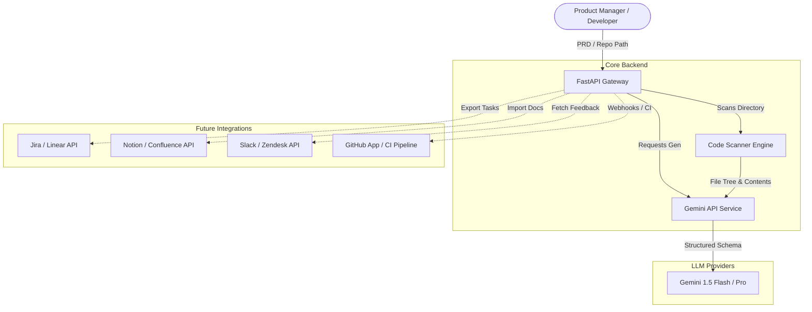

# Software Requirements Specification (SRS)
## Project: AI-Native Product Manager Copilot (Backend & Integrations)

---

## 1. Introduction

### 1.1 Purpose
This document specifies the software requirements for the **AI-Native Product Manager Copilot**. The goal of this system is to bridge the communication and workflow gap between Product Managers (PMs) and Engineering teams. It ingests unstructured product ideas and requirements (PRDs), evaluates them against local codebase context for technical feasibility, and generates structured, execution-ready sprint backlogs.

### 1.2 System Scope
The PM Copilot system operates as a developer/PM-centric backend service (FastAPI) powered by Google Gemini/GROK/OpenAI (LLM). In its current version, it provides static codebase scanning, architectural feasibility assessments, and automated user story generation. Future versions will support real-time feedback ingestion, predictive roadmapping, and deep bi-directional integrations with third-party software tracking and version control tools (Jira, Linear, GitHub).

---

## 2. System Architecture & Context

---

## 3. Functional Requirements (Current MVP)

### 3.1 Codebase Scanner Engine (`app/services/code_scanner.py`)
- **FR-1.1**: The system MUST scan local directory structures recursively when provided with a valid path.
- **FR-1.2**: The system MUST respect exclusion rules, automatically ignoring binaries, dependency directories (`node_modules`, `.venv`), and custom definitions from the workspace's `.gitignore` file.
- **FR-1.3**: The system MUST collect raw text contents of supported code extensions (Python, JavaScript, TypeScript, Rust, Go, HTML, CSS, Markdown, etc.).
- **FR-1.4**: The system MUST restrict total token/character count (configured via `MAX_SCAN_TOKENS` in `.env`) to prevent context window overflow or high API usage costs. If the limit is hit, the file contents will be gracefully truncated while maintaining the directory tree structure.

### 3.2 Technical Feasibility Analyzer (`app/services/feasibility.py`)
- **FR-2.1**: The system MUST accept a Product Requirement Document (PRD) and repository path payload.
- **FR-2.2**: The system MUST output an overall complexity rating (`Easy`, `Medium`, `Hard`) with a written technical rationale.
- **FR-2.3**: The system MUST identify exact file impacts, including creating new files, modifying existing files, or deleting obsolete components, with detailed instructions for each.
- **FR-2.4**: The system MUST list specific technical risks (e.g., performance bottlenecks, security issues, integration challenges) and propose mitigation plans.
- **FR-2.5**: The system MUST estimate total developer effort required in engineering hours.

### 3.3 Sprint & Agile Planner (`app/services/planner.py`)
- **FR-3.1**: The system MUST ingest PRD content alongside the structured technical feasibility report.
- **FR-3.2**: The system MUST decompose the required work into a structured sprint backlog comprising user stories, technical spikes, and development tasks.
- **FR-3.3**: The system MUST assign Fibonacci-based story points (`1`, `2`, `3`, `5`, `8`, `13`) to each ticket reflecting implementation overhead.
- **FR-3.4**: The system MUST categorize tasks based on priority (`High`, `Medium`, `Low`) and assign logical roles (`Frontend`, `Backend`, `DevOps`, `QA`).
- **FR-3.5**: Every generated ticket MUST contain explicit, testable **Acceptance Criteria**.

---

## 4. Integration Roadmap (Future Phases)

To scale the PM Copilot into a "Cursor for Product Managers", the following integrations and feature additions are planned:

### 4.1 Issue Trackers (Jira & Linear)
- **Use Case**: Export sprint backlogs directly to PM tools, bypassing manual copy-pasting.
- **Requirements**:
  - Bi-directional sync: Updating a task description in Jira updates the local PM Copilot context.
  - Epics & Subtasks: Automatically group generated sprint tasks under parent Epics.
  - Automated status tracking: Transition tasks to "In Progress" or "Done" based on codebase commits.

### 4.2 Document & Wiki Hubs (Notion & Confluence)
- **Use Case**: Directly source requirements from official company wikis and push generated PRDs.
- **Requirements**:
  - Live link sync: Import/Export specs via Notion databases and Confluence spaces.
  - Document templates: Apply customized corporate templates to the AI-generated PRDs.

### 4.3 Version Control & CI/CD (GitHub, GitLab, Bitbucket)
- **Use Case**: Verify code modifications match the PRD's goals directly inside Pull Requests.
- **Requirements**:
  - **Pull Request Auditing**: Run in a CI/CD pipeline to evaluate if a PR's file changes fulfill the acceptance criteria defined in the sprint plan.
  - **Automatic Branch Drafting**: Generate starter branches containing boilerplate directories/files identified in the Feasibility Analysis phase.

### 4.4 Communication Hubs (Slack & Microsoft Teams)
- **Use Case**: Quick ingestion of ad-hoc feedback and status reporting.
- **Requirements**:
  - `/copilot` Slack Command: Allows PMs to paste messages or feature ideas to generate raw PRD drafts on the fly.
  - Notification Engine: Send channel alerts when feasibility reports or sprint goals are calculated.

### 4.5 Customer Support Systems (Zendesk, Intercom, Salesforce)
- **Use Case**: Automated feedback aggregation for the "AI Feedback Intelligence Platform".
- **Requirements**:
  - Webhook ingestion: Listen to closed high-value support tickets.
  - Semantic clustering: Automatically cluster ticket texts using a vector database to highlight common feature requests and calculate "Customer Impact Scores".

---

## 5. Non-Functional Requirements

### 5.1 Performance & Latency
- **NFR-1.1**: The codebase scanner MUST complete scanning a standard repository (under 10,000 files) in less than 3 seconds.
- **NFR-1.2**: API response time for LLM generation should be optimized. When feasible, implement SSE (Server-Sent Events) to stream the PRD and sprint generation results.

### 5.2 Security & Privacy
- **NFR-2.1**: **Source Code Privacy**: Code scanned locally MUST NOT be stored by the backend. It must only be passed securely to the LLM API endpoint for transient reasoning.
- **NFR-2.2**: The backend API MUST run locally on the client network by default, ensuring code doesn't leave the developer's intranet without authorization.

### 5.3 Reliability
- **NFR-3.1**: The LLM parsing service MUST gracefully handle incomplete or unparsable JSON responses from the model by running a JSON validation cleanup script before returning the payload to the user.
